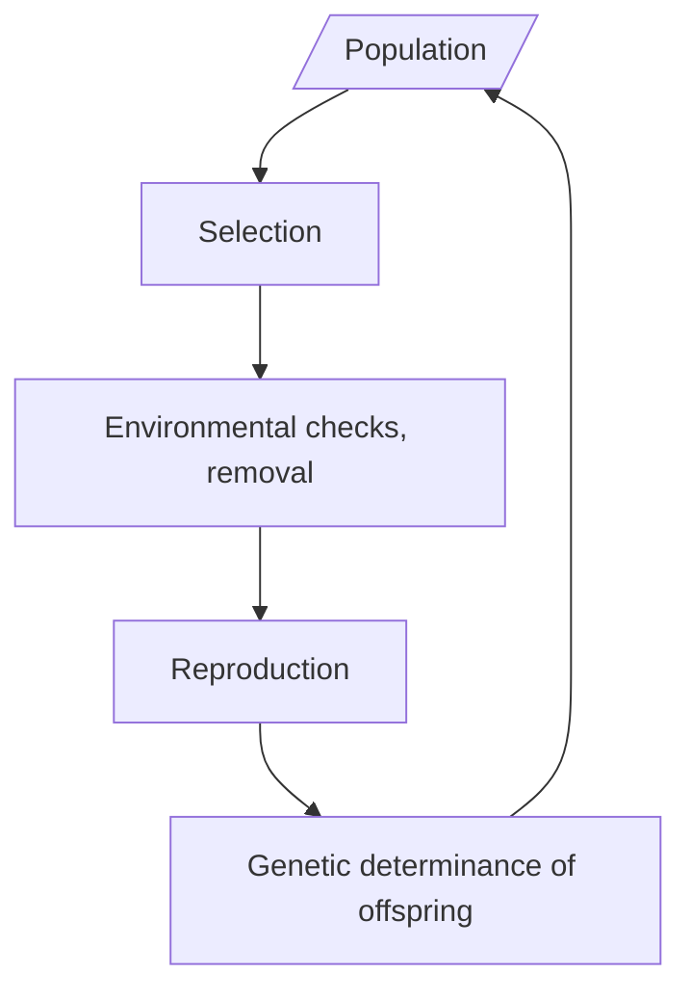

# SimEVO Devlog

## 17/11/2021

Current flowchart:

We need these constructs:

1. Populations
2. Organisms
3. Selective methods
4. Environmental factors
5. Genetic library

Priority of development

1. Genetic library
2. Organisms
3. Populations
4. Selective methods
5. Environmental factors