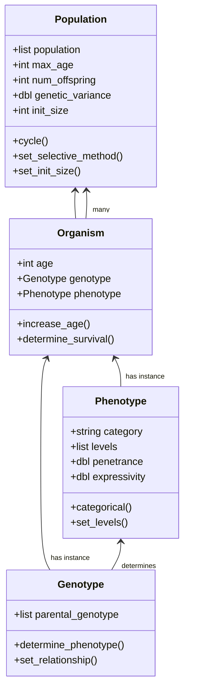
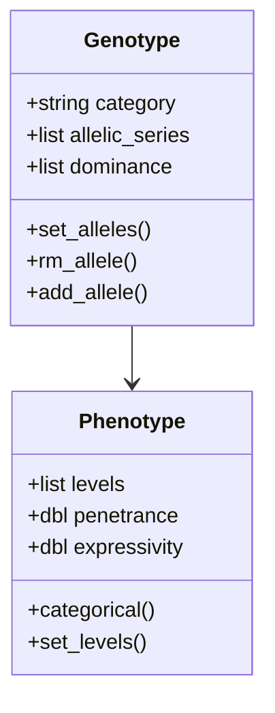
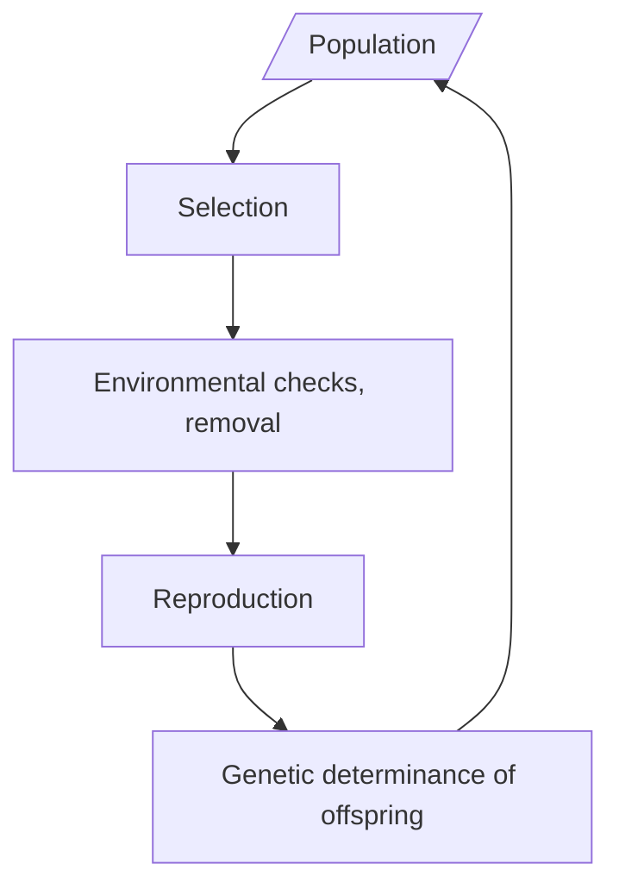

**Table of contents**

[TOC]

## Index of Notation

|      Notation       | Definition                                                   |
| :-----------------: | ------------------------------------------------------------ |
|    $\mathscr P$     | Population                                                   |
|     $p_\delta$      | Selected population                                          |
|        $p_b$        | Population which survives and reproduces                     |
|      $p_\psi$       | Removed population (individuals who die)                     |
|    $\mathscr E$     | Environment                                                  |
|   $\mathscr E_D$    | Set of environmental factor(s) $\mathscr E_\delta$           |
| $\mathscr E_\delta$ | Environmental factor                                         |
|       $S_{F}$       | Set of selective function(s) $S_{fun}$                       |
|      $S_{fun}$      | Selective function                                           |
|      $\lambda$      | Reproductive coefficient (number of offspring per individual) |
|       $\psi$        | Lethality of environmental factor                            |
|         $O$         | Organism                                                     |
|        $g_p$        | Phenotype                                                    |
|        $g_t$        | Genotype                                                     |
|     $\mathbf G$     | Abbreviated notation of $(g_t, g_p)$                         |
|         $D$         | Population difficulty (see definition)                       |
|         $A$         | Attribute.                                                   |
|     $\mathbf A$     | Set of all attributes present within population $\mathscr P$. |
|        $w_A$        | Fitness value for attribute $A$. If there are many attributes within a population, they are numbered by their index in the set $\mathbf A$, e.g. $w_{A}$. If using **AIM**, we only obtain one $w_t$ which represents the organisms total fitness. |
|       **AIM**       | Attribute Interplay Method                                   |
|       **ACM**       | Attribute Chaining Method                                    |

## Binary phenotypic determinance (BPD)

We consider the set $\mathscr P$, which consists of individual organisms $O$ such that $\mathscr P = \{O_1, \ldots, O_N\}$, where $N$ is the total number of organisms and hence the size of the population (i.e. $|\mathscr P| = N$). Per traditional eco-evolutionary biology we assume the population to be located within some environment $\mathscr E$ set such that $\mathscr E_D$ denotes the set of environmental factors $\mathscr E_\delta$ present within the environment where $|\mathscr E_D| \geq 1$. The lethality coefficient $\psi \in [0;1]$ determines the probability that a selected organism ($O \in p_\delta$) will pass to the removed population $p_r$ i.e. the selected organism dies. The lethality factor can be unique to one or all environmental factor.

​	We estimate the per turn change in population size to be proportional to the number of births into the population and the number of individuals who die as a result of selection. Mathematically, we can denote this as $\mathscr P'$, where
$$
\mathscr P' = \lambda(p_\delta - p_\psi) - p_\psi
$$
Because each step in time represents a population generation, we assume that most individuals within the population (or all) reproduce. This is where the reproductive coefficient $\lambda$ comes into play, e.g. $\lambda = 0.7$ denotes that 70% of organisms within the population to reproduce which results in $n_b = \lambda(p_\delta - p_\psi) = \lambda \cdot p_b $  *newborn* individuals. Note that this assumes that reproduction occurs only after an individual has survived his environment at a given time $t$. For ways of adjusting this, see the ecological section.

​	The selective population $p_\delta$ is determined by passing the $\mathscr P$ set through selective function(s) $S_{fun}\in S_{F}$. The benefit of defining the set $S_F$ which contain all the selective functions $S_{fun}$ is that it allows for the instantiation of new selective functions. Assume that the selective functions are a subclass of the function ``` selFunc```, we can define a new function ```selLow ``` which sorts individual's by trait value and picks the lowest ```percent```:

```python
import numpy as np

class SelectionMethods:
  
  # [...]
  
	def selLow(population, percent):
  	# Sort the list by descending trait value
  	np.sort(population, fitness, descending=TRUE)
  	select_range = ceil(len(population) * percent)
  	return np.select[1:select_range]
  
  	# Revise once the actual code is in place.
    
   # EOF
```

We view each environmental factor as a binary operation which takes in individual parameters of an organism $O$ and logically compares them. For example, in cases of binary phenotypic determinance of survival, we can notate the environmental factor as a logical comparison with output $\omega$, which is either ```1``` or ```0```, i.e. ```True``` or ```False```, which we interpret as the boolean statement ```survives```:
$$
\mathscr E_\delta (g_p): g_p \to \omega \: \bigg| \: \omega = \begin{cases} 1 & \text{ if $g_p > 0$} \\ 0 & \text{ if $g_p = 0$}\end{cases}
$$
**Note to self:** Add (in)haplosufficiency

If we assume this environmental factor to particularly refer to famine or hunger, we can write it as

```python
hungerFactor = envFactor(selLow, lethality = 0.7)
```

Check the definition of ```selLow``` above for more details.

## Non-binary phenotypic determinance (nBPD)

In cases of continuous phenotypes where trait values are distributed across a spectrum, determinance of survival can not be accurately estimated using a binary operation as simple as those presented in the section above.

We introduce the model attribute $w_A$ which represents trait value given attribute $A$. $w_A$ can be

- categorical (e.g. red, black, brown, tan)
- numeric (5.52 cm, 8.95 cm ...)
- boolean (although determination of survival has already been covered for this type of phenotype in the section above; see [Binary phenotypic determinance](#binary-phenotypic-determinance))

- an object (computationally intensive)
- user-defined

## Model parameters and methods

### Methods

#### Attribute Interplay method (AIM)

1. Consider the interplay between environmental and physiological attributes (such as the effect of wingspan on travel speed vs. increased metabolic activity as result of increased size and energy consumption)

2. Find accurate methods of describing the relationship between attributes

   1. **Two attributes:** For attributes $A_1$ and $A_2$ find function $f$ such that $f(A_1) = A_2$. We can thus determine the effect of attributes on each other.

   2. **More than two attributes:** Use multivariate regression
      $$
      \mathbf y = \mathbf X \beta + \epsilon
      $$
      To obtain description of interaction between attributes.

3. Obtain density fit of dataset with distribution of trait values

4. Express the function $\mathscr W(O)$ which takes an organisms set of attributes $\mathbf A$ as  input and returns its total fitness $w_t$.

#### Attribute chain method (ACM)

1. Identify environmental and physiological attributes that may affect chances of survival
2. Design environmental factors which accurately portray sensitivity and lethality
3. Find index order which allows for accurate ecological portrayal of selection (e.g. does predation occur on average before or after scavenging for food?)

In cases where we want to include multiple environmental factors, we can imagine  that the population is passed in some arbitrary order through a chain of environmental factors each with a designated selective function (note that this does not mean that environmental factors can not share the same selective function). This is represented by equation (4) below, where $M$ represents the total number of environmental factors:
$$
\text{Input $\mathscr P_t$ } \to \underbrace{\mathscr E_{\delta \: (1)}}_{S_{fun(1)}, \: \psi_1} \to \ldots \to \underbrace{\mathscr E_{\delta \: (M)}}_{S_{fun(M)}, \: \psi_M} \to \text{Output } \mathscr P_{t+1}
$$

### Parameters

#### Lethality factor $\psi$

#### Reproductive constant $\lambda$

#### Genetics

## Object hierarchy

### Population hierarchy



### Genetic hierarchy



### Algorithm flowchart



